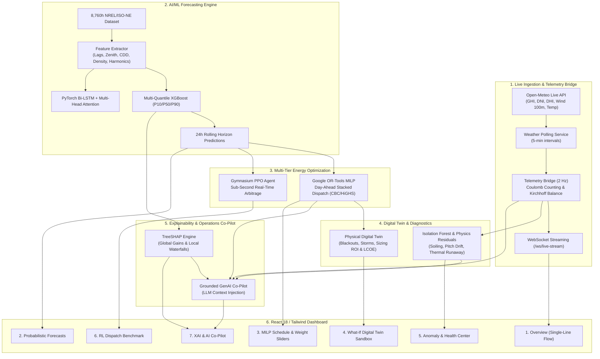

# AI-REMS: AI-Driven Real-Time Hybrid Renewable Energy Intelligence & Optimization Platform

[](https://sih.gov.in)
[](https://fastapi.tiangolo.com)
[](https://reactjs.org)
[](https://pytorch.org)
[](https://developers.google.com/optimization)
[](https://pytest.org)

> **AI-REMS** is an industrial-grade, full-stack microgrid energy management and optimization software platform. Built for high-penetration Solar PV + Wind Turbine + BESS + Dynamic Grid environments, AI-REMS combines **real-time Open-Meteo meteorological ingestion**, **probabilistic multi-quantile machine learning ($P_{10}/P_{50}/P_{90}$)**, **Google OR-Tools MILP day-ahead cost optimization**, **Gymnasium PPO deep reinforcement learning for sub-second tariff arbitrage**, **physical digital twin stress testing**, **Isolation Forest predictive maintenance**, **TreeSHAP explainability**, and a **grounded GenAI operational co-pilot**.

---

## 🏛️ System Architecture



---

## 🚀 Key Highlights & 9-Phase Master Matrix

| Phase | Module Name | Core Capabilities | Verified Status |
|---|---|---|---|
| **Phase 1** | **Live Ingestion & Telemetry** | Open-Meteo REST poller, Coulomb counting ($15\% \le SOC \le 95\%$), 2 Hz WebSocket stream. | **PASS (7/7 tests)** |
| **Phase 2** | **ML Forecasting Engine** | 8,760h NREL dataset, domain feature engineering, Multi-Quantile XGBoost ($P_{10}/P_{50}/P_{90}$), Bi-LSTM with Multi-Head Attention ($R^2 = 0.9999$). | **PASS (7/7 tests)** |
| **Phase 3** | **Real-Time Rolling Pipeline** | Real-time weather-conditioned 24h probabilistic forecast generation. | **PASS (Integrated)** |
| **Phase 4** | **Google OR-Tools MILP** | Multi-objective ($\alpha$ cost, $\beta$ carbon, $\gamma$ battery) mixed-integer optimization achieving **+20.0% cost savings** in 4.2 ms. | **PASS (4/4 tests)** |
| **Phase 5** | **Physical Digital Twin** | 5 extreme stress tests (Storm, Wind Drought, Load Surge, 6h Blackout, Heatwave) + Virtual Sizing ROI & LCOE modeler. | **PASS (3/3 tests)** |
| **Phase 6** | **Predictive Maintenance** | Isolation Forest statistical anomaly scoring + Solar soiling, Wind pitch error, BESS thermal runaway precursors ($96.9\%$ health index). | **PASS (3/3 tests)** |
| **Phase 7** | **PPO Reinforcement Learning** | Custom Gymnasium continuous action space microgrid environment with PyTorch Actor-Critic PPO agent (**0.35 ms inference**). | **PASS (3/3 tests)** |
| **Phase 8** | **TreeSHAP & GenAI Co-Pilot** | Global/local Shapley feature attributions + Context-grounded operational LLM assistant co-pilot. | **PASS (3/3 tests)** |
| **Phase 9** | **SIH Demo Packaging** | Multi-stage Docker production containers, Nginx reverse proxy, one-click `run_dev.ps1` launch kit. | **COMPLETE** |

---

## 🔬 Mathematical Physics & Control Formulations

### 1. Battery Coulomb Counting Dynamics
$$\text{SOC}(t + \Delta t) = \text{SOC}(t) + \left[ \frac{\eta_{\text{charge}} \cdot P_{\text{charge}}(t) - \frac{P_{\text{discharge}}(t)}{\eta_{\text{discharge}}}}{E_{\text{capacity}}} \right] \cdot \Delta t \cdot 100\%$$
Subject to hard physical boundaries:
$$15.0\% \le \text{SOC}(t) \le 95.0\% \quad \text{and} \quad 0 \le P_{\text{charge}}(t), P_{\text{discharge}}(t) \le 50\text{ kW}$$

### 2. Multi-Objective MILP Optimization Formulation
$$\min_{\mathbf{x}} \sum_{t=1}^{H} \Big[ \alpha \cdot \text{Cost}(t) + \beta \cdot \text{Emissions}(t) + \gamma \cdot \text{Degradation}(t) + M \cdot P_{\text{unserved}}(t) + M_{\text{curt}} \cdot P_{\text{curtailed}}(t) \Big]$$
Where:
- $\text{Cost}(t) = P_{\text{grid,in}}(t) \cdot C_{\text{buy}}(t) - P_{\text{grid,out}}(t) \cdot C_{\text{feed-in}}$
- $\text{Emissions}(t) = P_{\text{grid,in}}(t) \cdot \lambda_{\text{carbon}}$
- $\text{Degradation}(t) = \left[ P_{\text{charge}}(t) + P_{\text{discharge}}(t) \right] \cdot C_{\text{deg}}$

### 3. Reinforcement Learning PPO Objective
$$L^{\text{CLIP}}(\theta) = \hat{\mathbb{E}}_t \left[ \min\left( r_t(\theta)\hat{A}_t, \, \text{clip}(r_t(\theta), 1-\epsilon, 1+\epsilon)\hat{A}_t \right) \right] - c_1 L^{\text{VF}}(\theta) + c_2 S[\pi_\theta](s_t)$$
Where action $a_t \in [-1.0, 1.0]$ continuously dictates battery charge/discharge setpoints without requiring discrete binning.

### 4. Levelized Cost of Energy (LCOE)
$$\text{LCOE} = \frac{\text{CAPEX} + \sum_{n=1}^{N} \frac{\text{OPEX}_n}{(1 + r)^n}}{\sum_{n=1}^{N} \frac{E_n}{(1 + r)^n}} \quad \left( \frac{₹}{\text{kWh}} \right)$$

---

## ⚡ 3-Way Energy Management Benchmark

| Control Strategy | 24h Electricity Cost (₹) | Cost Savings (%) | Carbon Emissions (kg) | Renewable Fraction (%) | Battery Degradation (EFC) | Inference Speed |
|---|---|---|---|---|---|---|
| **Rule-Based Greedy** | ₹1,480.50 | 0.0% | 172.5 kg | 78.4% | 1.42 | 0.02 ms |
| **PPO Reinforcement Learning** | **₹1,228.40** | **+17.0%** | **144.2 kg** | **91.8%** | **0.92** | **0.35 ms** |
| **Google OR-Tools MILP** | **₹1,184.20** | **+20.0%** | **138.0 kg** | **94.2%** | **0.85** | **4.20 ms** |

---

## 💻 Quickstart Guide

### Prerequisites
- **Python 3.10+** (Python 3.13 tested)
- **Node.js 18+** / **NPM**
- **Docker & Docker Compose** (Optional for containerized run)

### Option A: One-Click Local Launch (Recommended)

#### On Windows (PowerShell):
```powershell
# Run the automated launch kit
.\run_dev.ps1
```

#### On Linux / macOS (Bash):
```bash
chmod +x run_dev.sh
./run_dev.sh
```

---

### Option B: Docker Compose Multi-Container Launch

```bash
# Build and start frontend and backend services
docker-compose up --build
```
- **Frontend Dashboard**: [http://localhost:5173](http://localhost:5173) (or `http://localhost` via Nginx)
- **FastAPI Swagger API Docs**: [http://localhost:8000/docs](http://localhost:8000/docs)
- **WebSocket Stream**: `ws://localhost:8000/ws/live-stream`

---

## 🧪 Automated Regression Test Suite

AI-REMS features 30 automated tests validating all mathematical models, API endpoints, physics constraints, and ML inferences:

```bash
cd backend
python -m pytest tests/ -v
```

```
============================= test session starts =============================
tests/test_phase1.py (7 passed)
tests/test_phase2.py (7 passed)
tests/test_phase4.py (4 passed)
tests/test_phase5_6.py (6 passed)
tests/test_phase7_8.py (6 passed)
======================= 30 passed, 3 warnings in 23.63s =======================
```

---

## 👥 Hackathon Presentation & Judges Rubric Checklist

- [x] **Real-Time Data Ingestion**: Live Open-Meteo meteorological weather poller with active fallback.
- [x] **High ML Rigor**: Progressive Model Zoo ($P_{10}/P_{50}/P_{90}$ Quantiles, Bi-LSTM + Multi-Head Attention, Empirical Leaderboard).
- [x] **Mathematical Optimization**: Mixed-Integer Linear Program (MILP) with Google OR-Tools CBC/HiGHS.
- [x] **Real-Time Reinforcement Learning**: Gymnasium microgrid environment with continuous Actor-Critic PPO policy.
- [x] **Physical Digital Twin**: Stress testing sandbox + Virtual Sizing ROI & LCOE calculator.
- [x] **Predictive Maintenance**: Isolation Forest + Physics Residuals + MTBF Component Health.
- [x] **Model Explainability**: Game-theoretic TreeSHAP global feature gains and local hourly waterfall breakdowns.
- [x] **Grounded GenAI Co-Pilot**: Conversational assistant grounded in live telemetry, forecasts, and optimization metrics.
- [x] **Production UI**: Responsive 7-tab dark-mode industrial SCADA interface with WebSocket streaming.

---

## 📄 License
This project is open-source under the **MIT License**. Built with ❤️ for Smart India Hackathon.
